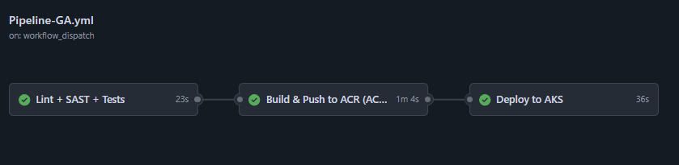

# DevOps Technical Assessment – End-to-End Solution

Este proyecto implementa una solución DevOps sobre Azure, cumpliendo los requisitos funcionales y técnicos del assessment *assets/"Assessment - DevOps"*.

La solución está dividida en **dos repositorios**, pero funciona como **un solo sistema**:


- **1. Infraestructura (Terraform + Azure)**  – crea la plataforma base en Azure (IaC).
[https://github.com/hsniama/infra-devops](https://github.com/hsniama/infra-devops)

- **2. Aplicación (FastAPI + Kubernetes + CI/CD)**  – construye, despliega y expone el microservicio.
[https://github.com/hsniama/app-devops](https://github.com/hsniama/app-devops)

El flujo correcto es **Infra → App**.

---

## Arquitectura general

- Azure Resource Group (DEV / PROD) - *Repo 1*
- Azure Kubernetes Service (AKS) - *Repo 1*
- Azure Container Registry (ACR) - *Repo 1*
- GitHub Actions con OIDC  - *Repo 1 y 2*
- ingress-nginx  - *Repo 2*
- cert-manager + Let’s Encrypt (TLS real) - *Repo 2*
- Redis (control de unicidad del JWT) - *Repo 2*
- DuckDNS para resolución pública - *Repo 2*

Todo el tráfico externo es **HTTPS**.

---

## Ambientes y ramas

| Rama Git        | Ambiente | Namespace        | Host público                      |
|-----------------|----------|------------------|-----------------------------------|
| `dev/**`        | DEV      | `devops-dev`     | `henrydevops-dev.duckdns.org`     |
| `main` (merge)  | PROD     | `devops-prod`    | `henrydevops-prod.duckdns.org`    |

- **DEV**: despliegue automático desde cualquier rama `dev/**`
- **PROD**: solo se despliega al hacer **merge a `main`**

---

# PARTE 1 – Infraestructura

Repositorio: [https://github.com/hsniama/infra-devops](https://github.com/hsniama/infra-devops)

*Dirigirse al link del Repositorio para entender el despliegue mediante IaC.*

# PARTE 2 – Aplicación

*Repositorio actual*

Este repo contiene:

- Microservicio FastAPI
- Dockerfile hardened (non-root)
- Manifests Kubernetes
- Pipeline CI/CD completo
- Despliegue automático a AKS

## Seguridad implementada

- API Key vía header
- JWT firmado (SH256)
- JWT válido una sola vez (one-time token)
- Expiración real basada en exp
- Redis para control de unicidad en Kubernetes
- TLS con Let’s Encrypt PROD
- Secrets gestionados con:
    - GitHub Environments

## Endpoints expuestos

### 1. Generar JWT
**Método:** `GET`  
**Endpoint:** `/generate-jwt`  
Devuelve un JWT válido una sola vez.

---

### 2. Endpoint protegido
**Método:** `POST`  
**Endpoint:** `/DevOps`  

**Headers requeridos:**
- `X-Parse-REST-API-Key`
- `X-JWT-KWY`


## Cómo probar la solución (para el evaluador) 
### 1. Definir el HOST 

Si es para **DEV:** 
```bash 
HOST="henrydevops-dev.duckdns.org"
```
Si es para **PROD:** 
```bash 
HOST="henrydevops-prod.duckdns.org"
```

### 2. Obtener el JWT

```bash 
JWT="$(curl https://${HOST}/generate-jwt | sed -E 's/.*"jwt":"([^"]+)".*/\1/')"
```
### 3. Consumir el endpoint protegido

```bash 
curl -X POST \
  -H "X-Parse-REST-API-Key: 2f5ae96c-b558-4c7b-a590-a501ae1c3f6c" \
  -H "X-JWT-KWY: ${JWT}" \
  -H "Content-Type: application/json" \
  -d '{"message":"This is a test","to":"Juan Perez","from":"Rita Asturia","timeToLifeSec":45}' \
  "https://${HOST}/DevOps"
```

Respuesta esperada:
```bash 
{
  "message": "Hello Juan Perez your message will be send"
}

```

### 4. Validar unicidad del JWT

Repetir el POST con el mismo JWT devuelve:

```bash 
{
  "detail": "Invalid or missing JWT"
}

```

## TLS / HTTPS

- Certificados emitidos por Let’s Encrypt PROD
- Cadena completa válida (sin -k)
- Redirección forzada HTTP → HTTPS
- Verificado con:


```bash 
openssl s_client -connect ${HOST}:443 -servername ${HOST}
```

## CI/CD

El pipeline ejecuta se ejecuta todo usando OIDC, sin secretos de Azure en GitHub.:

 1. Lint (flake8)
 2. SAST (bandit)
 3. Tests (pytest + coverage)
 4. Build Docker
 5. Push a ACR
 6. Deploy a AKS
 7. Smoke test vía HTTPS





## Conclusión

Esta solución cumple:

- Infraestructura como código
- CI/CD 
- HTTPS válido
- Escalabilidad
- Separación DEV / PROD

La solución es reproducible desde cero siguiendo este README:

- [EXECUTION README](assets/EXECUTION.md)
