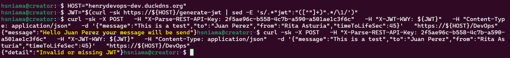
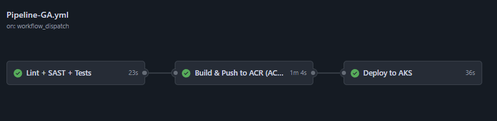
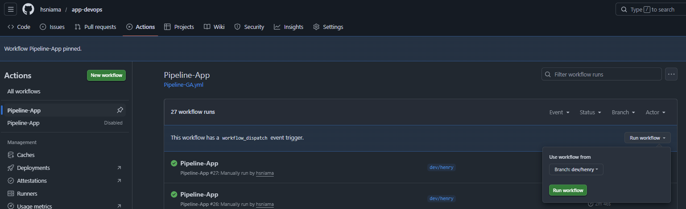

# DevOps Technical Assessment – Solución

La solución DevOps del assesment *assets/"Assessment - DevOps.pdf* está compuesta por dos repositorios que trabajan en conjunto para desplegar una aplicación sobre Azure:

### Infraestructura (Repo: `infra-devops`)

- Azure Resource Groups: Separación lógica entre entornos `DEV` y `PROD`.
- Azure Kubernetes Service (AKS): Clúster gestionado para orquestar contenedores.
- Azure Container Registry (ACR): Almacén privado para imágenes Docker.
- GitHub Actions con OIDC: Integración segura para despliegues automatizados sin secretos estáticos.

[https://github.com/hsniama/infra-devops](https://github.com/hsniama/infra-devops)

### Aplicación (Repo: `app-devops`)

- FastAPI + Redis: Microservicio con control de unicidad de JWT mediante Redis.
- CI/CD con GitHub Actions: Pipeline automatizado para construir, testear y desplegar.
- Ingress-nginx: Controlador de entrada HTTP para enrutar tráfico hacia los pods.
- Cert-manager + Let's Encrypt: Emisión automática de certificados TLS reales en `PROD`.
- DuckDNS: Resolución de dominio público para exponer el servicio externamente

[https://github.com/hsniama/app-devops](https://github.com/hsniama/app-devops)

### Seguridad y Entornos

- Todo el tráfico externo en `PROD` se enruta por HTTPS con certificados válidos.
- En `DEV`, se permite tráfico HTTP para facilitar pruebas locales.

El flujo correcto es **Infra → App**.

---

## Tecnologías usadas

- Programación: Python con FastAPI
- Contenerización: Docker
- IaC: Cloud Azure
- CI/CD: GitHub Actions

---

## Explicación

Una ves hallamos desplegado primero la infraestructura del proyecto mediante el Repositorio: [https://github.com/hsniama/infra-devops](https://github.com/hsniama/infra-devops), vamos a entender más a fondo este repositorio de la aplicación.

Este repo contiene:

- Microservicio FastAPI
- Dockerfile hardened (non-root)
- Manifests Kubernetes
- Pipeline CI/CD completo
- Despliegue automático a AKS

### Seguridad implementada

- API Key vía header
- JWT firmado (SH256)
- JWT válido una sola vez (one-time token)
- Expiración real del JWT
- Redis para control de unicidad en Kubernetes
- TLS con Let’s Encrypt PROD
- Secrets gestionados con:
    - GitHub Environments

### Ambientes y ramas

| Rama Git        | Ambiente | Namespace        | Host público                      |
|-----------------|----------|------------------|-----------------------------------|
| `dev/**`        | DEV      | `devops-dev`     | `henrydevops-dev.duckdns.org`     |
| `main` (merge)  | PROD     | `devops-prod`    | `henrydevops-prod.duckdns.org`    |

- **DEV**: despliegue automático desde cualquier rama `dev/**`
- **PROD**: solo se despliega al hacer **merge a `main`**

### Endpoints expuestos

#### 1. Generar JWT
**Método:** `GET`  
**Endpoint:** `/generate-jwt`

Devuelve un JWT válido una sola vez por transacción.

#### 2. Endpoint protegido
**Método:** `POST`  
**Endpoint:** `/DevOps`  

**Headers requeridos:**
- `X-Parse-REST-API-Key`
- `X-JWT-KWY`

---

## Cómo probar la solución (para el evaluador)

Abrir una terminar Unix:

### 1. Definir el HOST 

Si es para **DEV:** 
```bash 
HOST="henrydevops-dev.duckdns.org"
```
Si es para **PROD:** (previo despliege)
```bash 
HOST="henrydevops-prod.duckdns.org"
```

### 2. Obtener el JWT

```bash 
JWT="$(curl -sk https://${HOST}/generate-jwt | sed -E 's/.*"jwt":"([^"]+)".*/\1/')"
```
### 3. Consumir el endpoint protegido

```bash 
  curl -sk -X POST \
  -H "X-Parse-REST-API-Key: 2f5ae96c-b558-4c7b-a590-a501ae1c3f6c" \
  -H "X-JWT-KWY: ${JWT}" \
  -H "Content-Type: application/json" \
  -d '{"message":"This is a test","to":"Juan Perez","from":"Rita Asturia","timeToLifeSec":45}' \
  "https://${HOST}/DevOps"
```

Respuesta esperada:
```bash 
{
  "message": "Hello Juan Perez your message will be send"
}

```

### 4. Validar unicidad del JWT

Repetir el POST con el mismo JWT devuelve:

```bash 
{
  "detail": "Invalid or missing JWT"
}

```

Ejemplo práctico:



---

## CI/CD

El pipeline se ejecuta usando OIDC (no secrets de Azure) para autenticar GitHub Actions contra Azure.:

 1. Lint (flake8)
 2. SAST (bandit)
 3. Tests (pytest + coverage)
 4. Build Docker
 5. Push a ACR
 6. Deploy a AKS
 7. Smoke test vía HTTPS



No necesariamente necesitas modificar algo en la rama `dev/**`, se puede correr el workflow de forma manual:



---

## Conclusión

Esta solución cumple:

- Infraestructura como código
- CI/CD 
- HTTPS válido (para prod)
- Escalabilidad
- Separación DEV / PROD

La solución es reproducible desde cero siguiendo el README:

- [EXECUTION.md](assets/EXECUTION.md)
