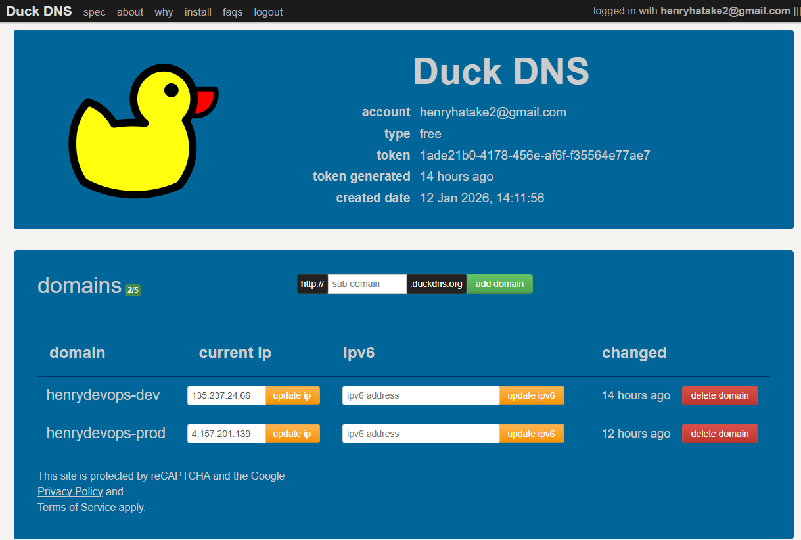
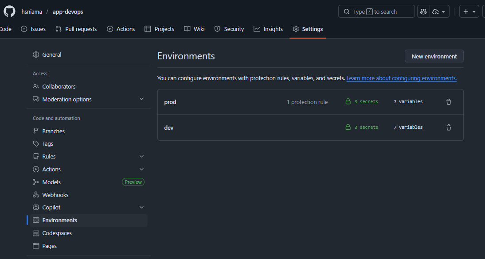
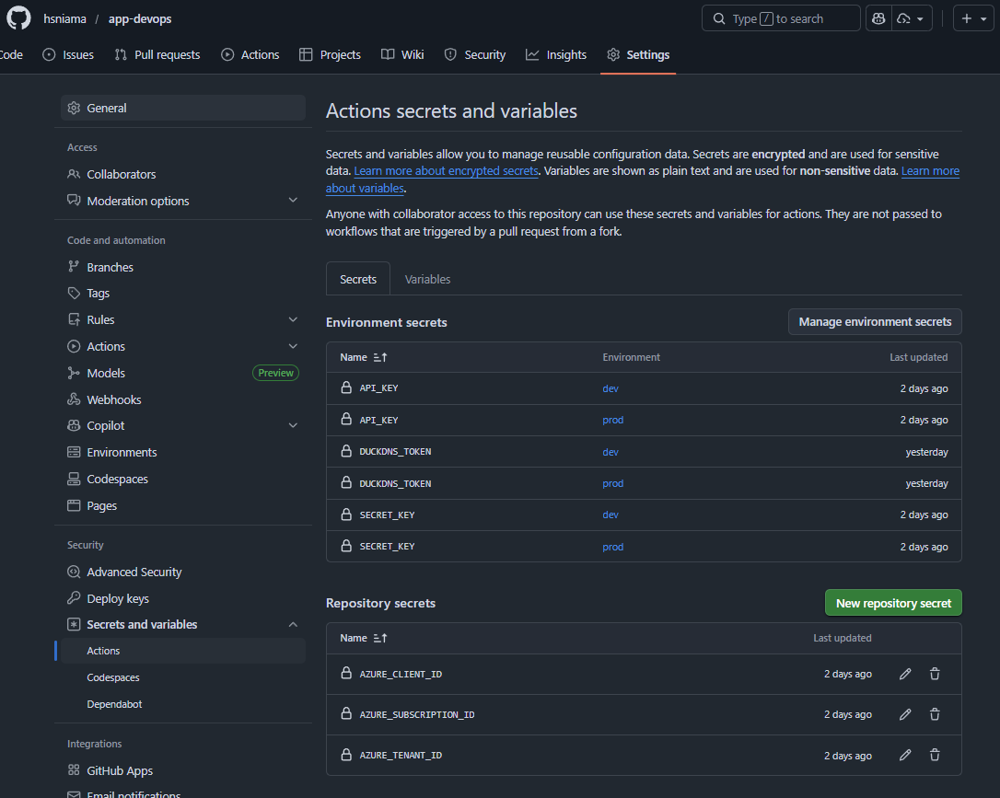
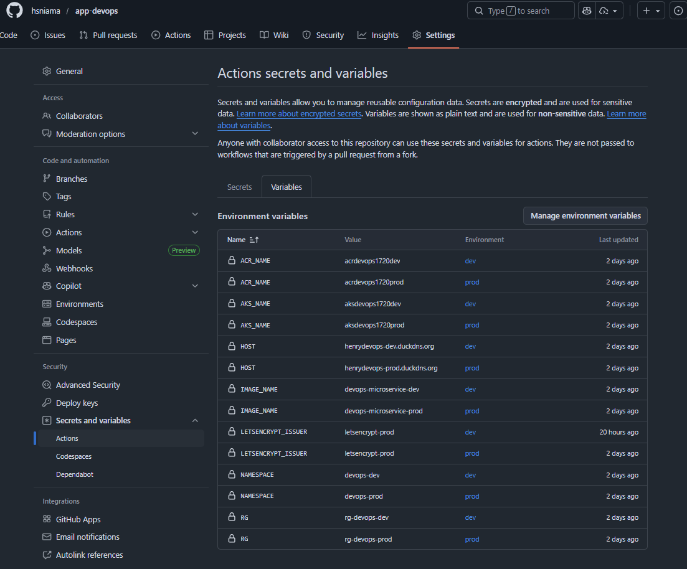

## Descarga del Proyecto

### Clona el repositorio

```bash
git clone https://github.com/hsniama/app-devops
```
```bash
cd app-devops
```
### Crea entorno virtual e instala dependencias

**Elimina el entorno virtual**
```bash
rm -rf .venv
```
**Crea un nuevo entorno**
```bash
python3 -m venv .venv
```
**Actívalo con este comando en caso de usar Linux/macOS**
```bash
source .venv/bin/activate
```
**Actívalo con este comando en caso de usar Windows**
```bash
.venv\Scripts\activate
```
**Asegura que pip está actualizado**
```bash
pip install --upgrade pip
```
**Instala dependencias**
```bash
pip install -r requirements.txt
```

---

## Ejecución del Proyecto.

Existen 3 formas de probar este microservicio.

### 1. Ejecutarlo de forma local con Uvicorn

Si clonaste el repositorio y creaste el entorno virtual e instalastes las dependencias, ejecuta en una nueva terminal dentro de la ubicación del proyecto: 

```bash
uvicorn app.main:app --reload
```


Ahora ya puedes ejecutar los 2 endpoint mencionados anteriormente o acceder a Swagger UI: [http://localhost:8000/docs](http://localhost:8000/docs)

```bash
curl -X GET http://localhost:8000/generate-jwt
```
```bash
curl -X POST http://localhost:8000/DevOps \
  -H "X-Parse-REST-API-Key: 2f5ae96c-b558-4c7b-a590-a501ae1c3f6c" \
  -H "X-JWT-KWY: (endpoint obtenido en el primer endpoint get, reemplazarlo aquí borrando parentesis)" \
  -H "Content-Type: application/json" \
  -d '{
    "message": "Hola",
    "to": "Henry",
    "from": "Azure",
    "timeToLifeSec": 45
}'
```

### 2. Ejecutarlo con Docker (Local)

Este microservicio puede correr completamente en un contenedor Docker antes de desplegarlo a la nube.
Si clonaste el repositorio, sigue los siguientes pasos en una nueva terminal en la misma ubicación:


### Crear imagen y correr contenedor
#### Creación de imagen
```bash
docker build -t devops-microservice .
```
#### Creación de contenedor (expone puerto 8000)
```bash
docker run --name devops-microservice \
  --env-file .env \
  -p 8000:8000 \
  devops-microservice
```


Ahora ya puedes ejecutar los 2 endpoint mencionados anteriormente y probar el microservicio.

Nota: Antes de crear el contenedor, debes **pausar** uvicorn del primer paso (Ctrl + Z) o cerrar esa terminal ya que el contenedor y el servidor web uvicorn local ocupan el mismo puerto 8000.


### 3. Despliegue en ACR y AKS (IaC)

#### Creación del APP Registration + Service principal

Este script automatiza la creación de: 

- App registration + service principal
- Roles (Owner/Contributor + AKS + ACR + Storage si se necesita)
- Federated credentials por GitHub Environments (dev y prod)

- Nota: 
  - Aquí no tocamos el backend storage (eso es del repo infra).
  - Este SP solo necesita permisos para ACR + AKS + RG del ambiente.

Primero dar permisos al archivo:
```bash
chmod +x scripts/bootstrap-oidc.sh
```
Después ejecutarlo:
```bash
./scripts/bootstrap-oidc.sh
```

Como resultado de la ejecución del script se tiene los siguientes valores que deben ser seteados en GitHub Secrets en el repo de la aplicación:

```bash
echo "Poner estos GitHub Secrets en el repo app-devops:"
echo "AZURE_CLIENT_ID=$APP_ID"
echo "AZURE_TENANT_ID=$TENANT_ID"
echo "AZURE_SUBSCRIPTION_ID=$SUBSCRIPTION_ID"
```

#### Creación del token en DuckdDNS

Esto es opcional y sirve para asignar un nombre de dominio fijo a la dirección nuestro ingress IP.



[https://www.duckdns.org/](https://www.duckdns.org/)


#### Environments en GitHub

Crear los dos ambientes de `dev` y `prod` en GitHub:



Tener en cuenta que en `prod` se debe agregar la protection rule de required provider.

#### Actions secrets and variables

Crear los siguientes actions secrets y variables





En el secret `SECRET_KEY` poner el valor que se encuentra en el archivo **.env** del repositorio.

#### Visión general de Kubernetes

La aplicación se despliega en AKS usando Kubernetes manifests separados por responsabilidad:

- cert-manager para TLS automático.
- Ingress para exposición pública.
- Deployment + Service para la app.
- HPA para escalado automático.
- Namespace y Secrets para aislamiento.
- Redis para garantizar unicidad del JWT por transacción.”

Estos archivos se los encuentra en la ruta `./k8s`.

#### Explicación del Pipeline

Este pipeline `/.github/workflows/Pipeline-GA.yml`. hace 3 cosas, en este orden:

  - CI: valida calidad del código (lint), seguridad básica (bandit) y pruebas (pytest).

  - Build & Push: construye la imagen Docker y la publica en ACR usando az acr build (ACR Tasks).

  - Deploy: instala dependencias del cluster (ingress-nginx + cert-manager si faltan), aplica manifests, actualiza la imagen del Deployment a un tag inmutable (SHA), espera el rollout, y finalmente actualiza DuckDNS para que el dominio apunte a la IP del LoadBalancer.

Además, usa OIDC (no secrets de Azure) para autenticar GitHub Actions contra Azure.

#### Triggers y ejecución del proyecto

Una ves se haya realizado todas las configuraciones previas, y se tenga clonado el repositorio:

- Si haces push a `dev/**` → corre pipeline y despliega a `DEV`.

- Si haces push a `main` → corre pipeline y despliega a `PROD`.

- workflow_dispatch → lo puedes correr manualmente.

**Importante:** aquí no hay pull_request.
Eso significa: PR a main no corre pipeline, solo corre cuando ya se hace merge (push a main).

```bash
on:
  workflow_dispatch:
  push:
    branches:
      - "main"
      - "dev/**"
```

Cualquier duda sobre el despliegue  y funcionamiento de este código, comunicarse con : [henryniama@hotmail.com](mailto:henryniama@hotmail.com)