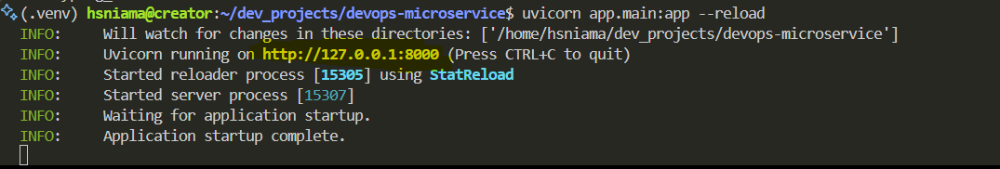
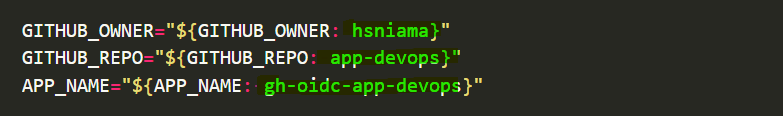
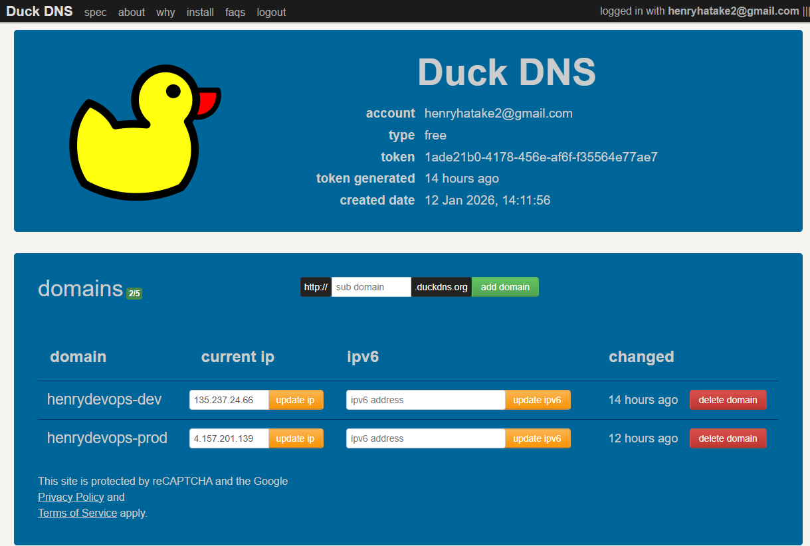
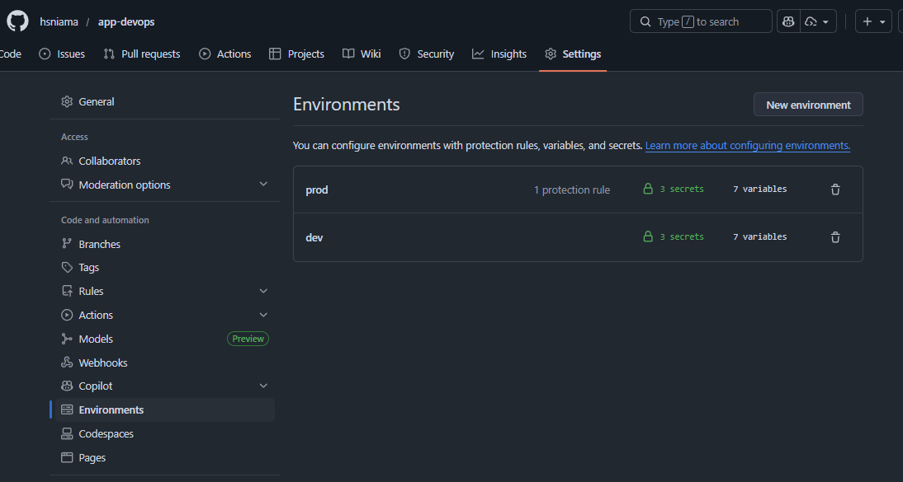
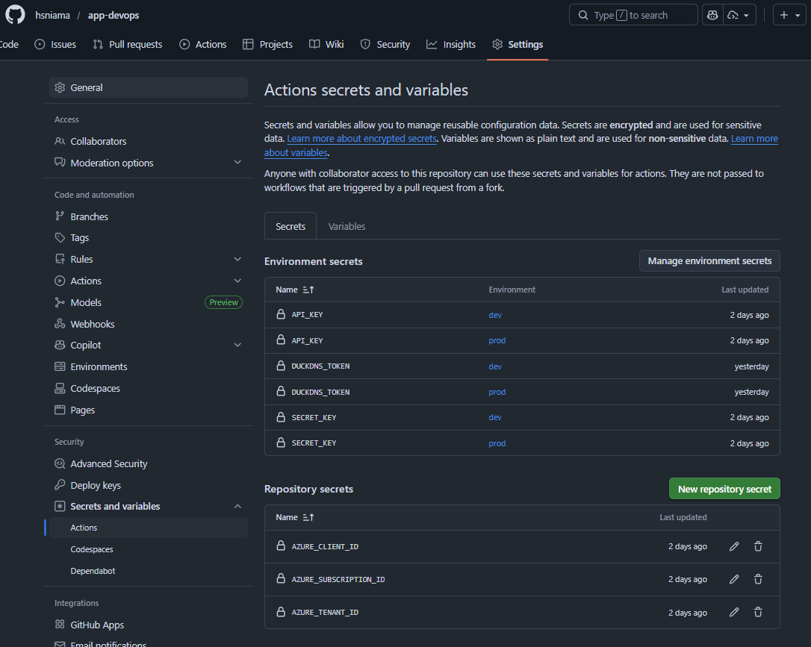
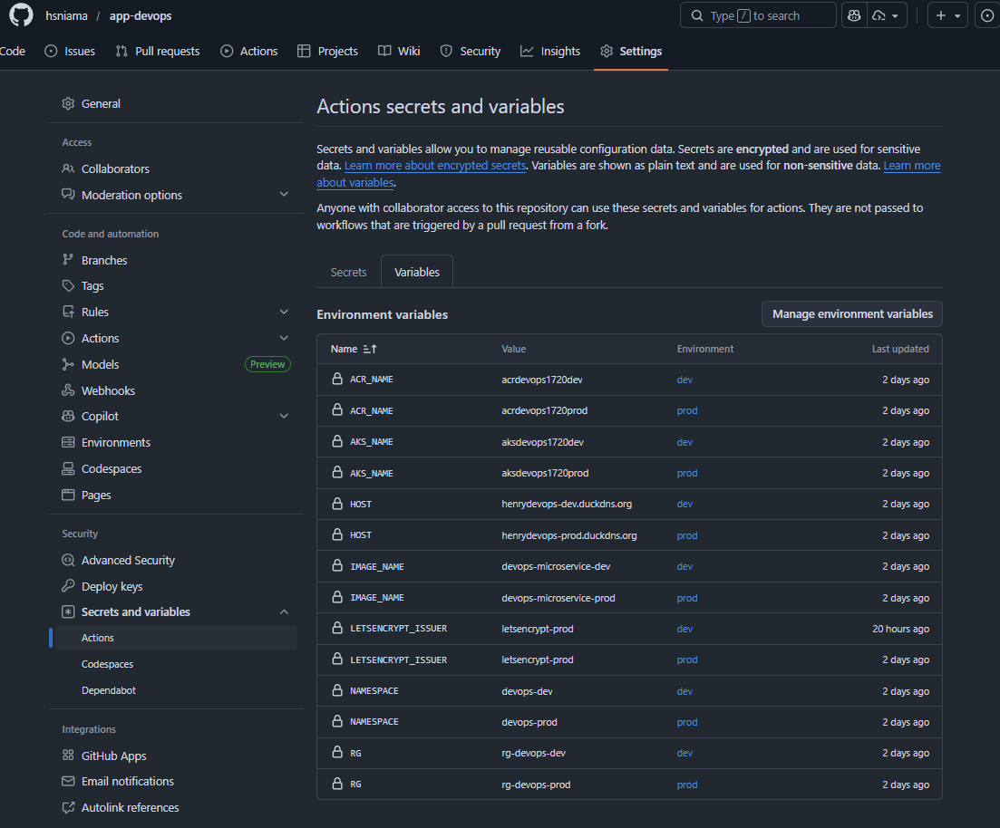
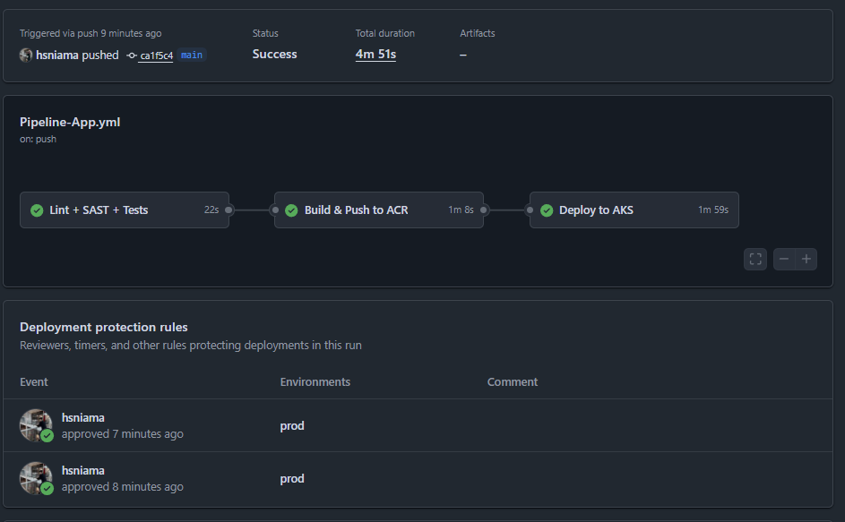
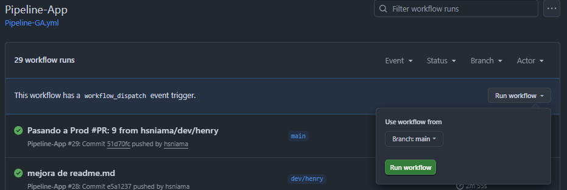

## Cómo correr el proyecto de forma Local

### 1. Clona el repositorio

```bash
git clone https://github.com/hsniama/app-devops.git
cd app-devops
```

### 2. Crea entorno virtual e instala dependencias

**Elimina el entorno virtual**
```bash
rm -rf .venv
```
**Crea un nuevo entorno**
```bash
python3 -m venv .venv
```
**Actívalo con este comando en caso de usar Linux/macOS**
```bash
source .venv/bin/activate
```
**Actívalo con este comando en caso de usar Windows**
```bash
.venv\Scripts\activate
```
**Asegura que pip está actualizado**
```bash
pip install --upgrade pip
```
**Instala dependencias**
```bash
pip install -r requirements.txt
```
Si va a correr tests o usar herramientas de desarrollo, también puede instalar
```bash
pip install -r requirements-dev.txt
```
**Crear el archivo .env**
```bash
cp .env.example .env
```

### 3. Correr la app localmente
**Opción A: Usando Uvicorn directamente**
```bash
uvicorn app.main:app --reload
```


**Opción B: Usando Docker**
```bash
docker build -t app-devops .
docker run -p 8000:8000 --env-file .env app-devops
```
Ya se puede probar los dos endpoint con cualquiera de las dos opciones, que se observará cómo en la siguiente sección.

---

## Probar el Proyecto de forma Local.

Una ves el proyecto este corriendo localmente ya sea con la Opción A o la B, abrir el terminal y ejecutar lo siguiente para probar los 2 endpoint y entender su lógica de funcionamiento:

```bash
curl -X GET http://localhost:8000/generate-jwt
```
El resultado obtenido de este Curl Get, reemplazarlo en *X-JWT-KWY* del siguiente Curl Post:
```bash
curl -X POST http://localhost:8000/DevOps \
  -H "X-Parse-REST-API-Key: 2f5ae96c-b558-4c7b-a590-a501ae1c3f6c" \
  -H "X-JWT-KWY: (endpoint obtenido en el primer endpoint get, reemplazarlo aquí borrando parentesis)" \
  -H "Content-Type: application/json" \
  -d '{
    "message": "Hola",
    "to": "Henry",
    "from": "Azure",
    "timeToLifeSec": 45
}'
```

Adiciona, se puede ejecutar los 2 endpoint mencionados anteriormente a través de Swagger UI: [http://localhost:8000/docs](http://localhost:8000/docs)

---

## Despliegue del proyecto en Azure mediante ACR y AKS (IaC)

Ya sea que hayamos corrido o ejecutado el proyecto de forma local, la idea de este Assesment es hacerlo mediante la nube, en este caso, se hace con *Azure*. 

Como requisito, nuestra Infraestructura (ACR, AKS, etc) debe estar desplegada, y se detalla en el siguiente repositorio: [https://github.com/hsniama/infra-devops](https://github.com/hsniama/infra-devops).

Una vez desplegada, se sigue los siguientes pasos:

#### 1. Creación del APP Registration + Service principal

El siguiente script ubicado en la dirección *scripts/bootstrap-oidc.sh* automatiza la configuración de una integración entre GitHub Actions y Azure usando OIDC (OpenID Connect).

Lo que realiza es lo siguiente: 

- Crear la App Registration en Entra ID
- Asigna el rol Owner a la aplicación en el nivel de la suscripción de Azure.
- Configurar credenciales federadas (OIDC) por Environments (dev y prod)
- Finalmente, mostrar secretos para GitHub

Primero, entrar al script y cambiar los valores en verde por los tuyos:



Segundo, dar permisos al archivo a través de la terminal:
```bash
chmod +x scripts/bootstrap-oidc.sh
```
Después, ejecutarlo:
```bash
./scripts/bootstrap-oidc.sh
```

Como resultado de la ejecución del script se tiene los siguientes valores que deben ser seteados en GitHub Secrets en este repo de la aplicación:

```bash
echo "Poner estos GitHub Secrets en el repo app-devops:"
echo "AZURE_CLIENT_ID=$APP_ID"
echo "AZURE_TENANT_ID=$TENANT_ID"
echo "AZURE_SUBSCRIPTION_ID=$SUBSCRIPTION_ID"
```

#### 2. Creación del token en DuckdDNS

Esto es opcional y sirve para asignar un nombre de dominio fijo a la dirección de nuestro ingress IP.



[https://www.duckdns.org/](https://www.duckdns.org/)


#### 3. Crear Environments en GitHub

Crear los dos ambientes de `dev` y `prod` en el repositorio de GitHub:



Tener en cuenta que en `prod` se debe agregar la protection de "required reviewers" para que no se despliegue a prod sin aprobación.

#### 4. Crear los Actions secrets and variables

Crear los siguientes actions secrets y variables por ambiente en el repositorio de GitHub:

**Actions:**



En `SECRET_KEY` y `API_KEY` poner el valor que se encuentra en el archivo **.env.example** en el repositorio.
En este caso, los dos valores previos y tambien el de `DUCKDNS_TOKEN` son los mismos para `dev` y `prod`.

Nota: El valor de `DUCKDNS_TOKEN` se lo genera en la página web logueandote con una cuenta y generando el token.

**Variables:**



Tener en cuenta que los valores de `ACR_NAME`, `AKS_NAME` provienen del resultado del despliegue de la infraestructura del repositorio de Infra (IaC) y deben ser único globales.

Todas las demás variables pueden/deben ser las mismas.

Una ves terminado de configurar todo, se puede crear la rama `dev/**` y hacer el primer push para desplegar al ambiente de `dev` y si se hace un merge a la rama `main` se despliega el microservicio a producción. 


## Visión general de Kubernetes

La aplicación se despliega en AKS usando Kubernetes manifests separados por responsabilidad:

- cert-manager para TLS automático.
- Ingress para exposición pública.
- Deployment + Service para la app.
- HPA para escalado automático.
- Namespace y Secrets para aislamiento.
- Redis para garantizar unicidad del JWT por transacción.”

Estos archivos se los encuentra en la ruta `./k8s`.

## Explicación del Pipeline

Este pipeline `/.github/workflows/Pipeline.yml`. hace 3 cosas, en el siguitene orden:

  - CI: valida calidad del código (lint), seguridad básica (bandit) y pruebas (pytest).
  - Build & Push: construye la imagen Docker y la publica en ACR usando az acr build (ACR Tasks).
  - Deploy: instala dependencias del cluster (ingress-nginx + cert-manager si faltan), aplica manifests, actualiza la imagen del Deployment a un tag inmutable (SHA), espera el rollout, y finalmente actualiza DuckDNS para que el dominio apunte a la IP del LoadBalancer.

Además, usa OIDC (no secrets de Azure) para autenticar GitHub Actions contra Azure.



### Triggers y ejecución del proyecto

Una ves se haya realizado todas las configuraciones previas, y se tenga clonado el repositorio:

- Si haces push a `dev/**` → corre pipeline y despliega a `DEV`.
- Si haces merge a `main` desde `dev/**` → corre pipeline y despliega a `PROD`.
- workflow_dispatch → lo puedes correr manualmente.



Cualquier duda sobre el despliegue  y funcionamiento de este código, comunicarse con : [henryniama@hotmail.com](mailto:henryniama@hotmail.com)